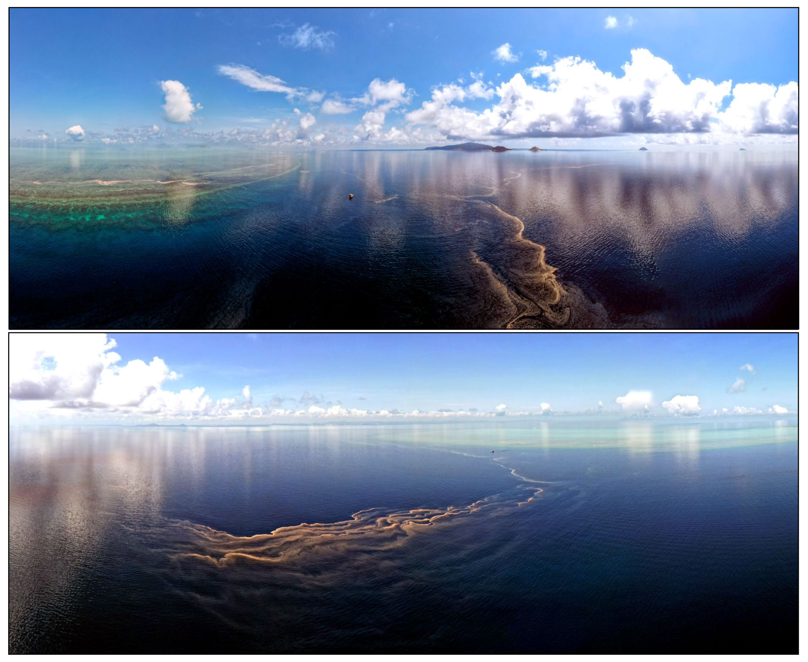

```{r setup, include=FALSE}
knitr::opts_chunk$set(echo = TRUE)
```

## reefspawn: an r package for quantifying reef-scale coral spawning

```{r eval=FALSE}

remotes::install_github("http://marine-ecologist.github.io/reefspawn/")


```


